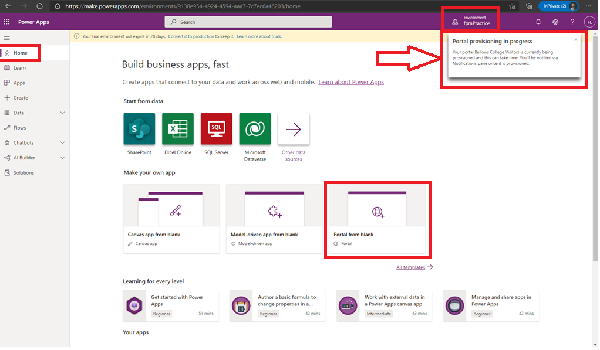

# Module 0: Course introduction

Lab: Validate lab environment

Exercise 1 - Setup

Task 1 - Acquire your Power Platform trial tenant

Task #2 - Create environment

Exercise #2: Provision a Power Apps porta

Task #1: Create Power Apps portal

