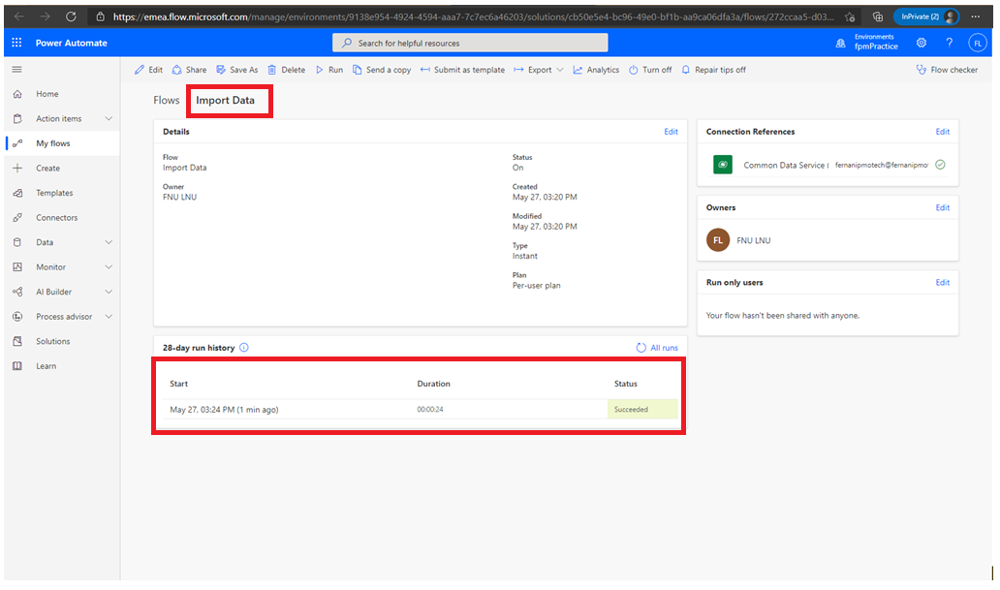

# Module 2: Introduction to Microsoft Dataverse

Lab: Data Modeling

Exercise #1: Create Solution

Task #1: Create Solution and Publisher

Exercise #2: Add Existing and Create New Tables

Task #1: Add Existing Table

Task #2: Create Building Table

Task #3: Create Visit Table and Columns

Exercise #3: Create Relationships

Task #1: Create Relationships

Exercise #4: Import Data

Task #1: Import solution

Task #2: Import Data

Task #3: Verify Data Import

