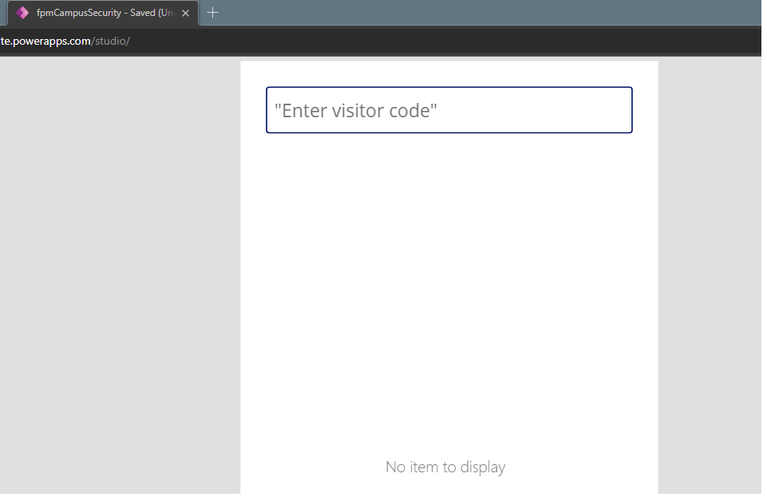

# Model 3: Get Started with Power Apps

Lab 2: How to build a canvas app, part 2

Exercise #1: Create Security Canvas App

Task #1: Create Canvas App

Task #2: Display Visitor information

Task #3: Add Check In and Check Out Buttons

Task #4: Enable and disable buttons depending on visit data

Task #5: Complete Check In and Check Out Process

Task #6: Add visual indicators

Task #7: Publish the app

