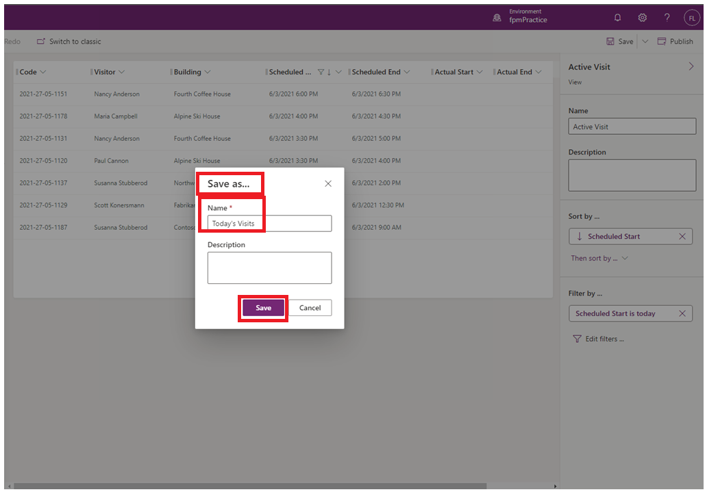

# Module 3: Get started with Power Apps

Lab 3: How to build a model-driven app

Exercise #1: Customize Views and Forms

Task #1: Edit Visit Form

Task #2: Edit Visit Views:

Exercise #2: Create Model driven Aplication:

Task #1: Create Application

