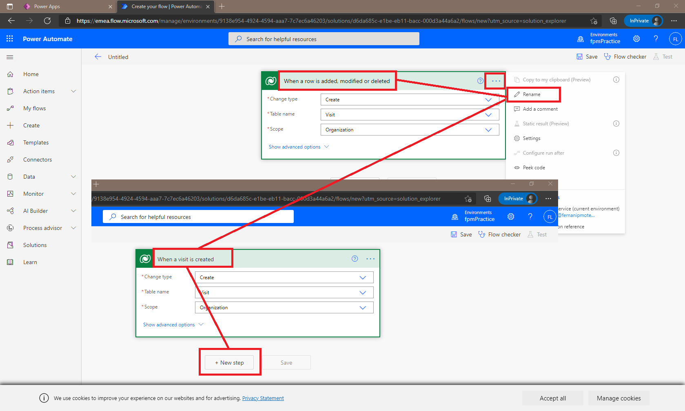
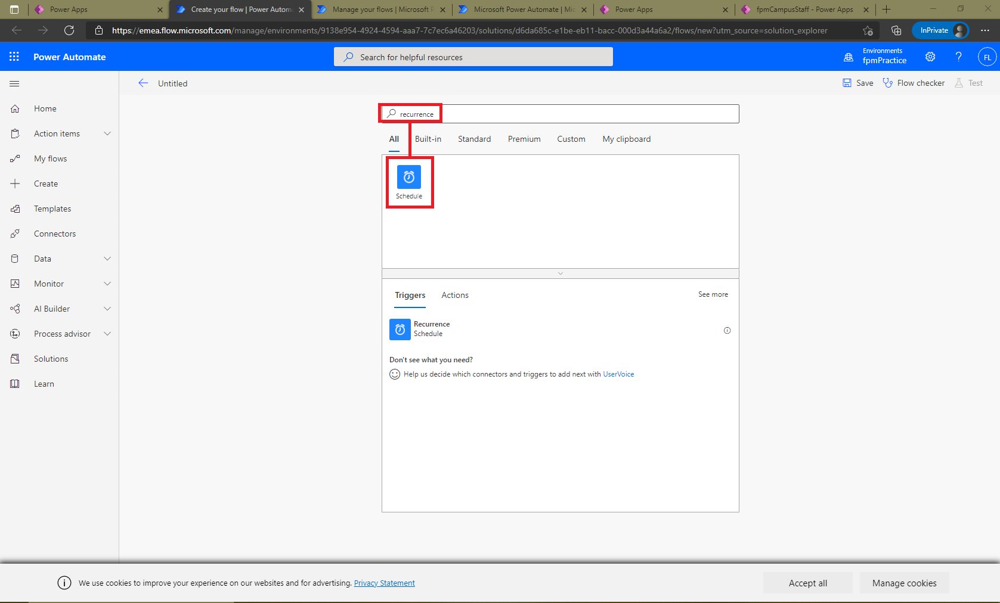
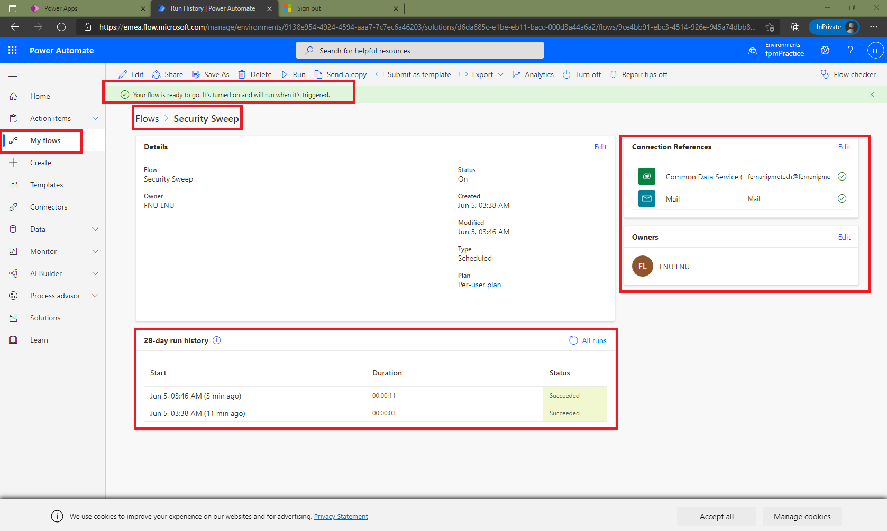

# Module 4: Get Started with Power Automate

**Lab: How to build an automated solution**

Exercise #1: Create Visit Notification flow

Task #1: Create flow

Task #2: Validate and test the flow

Exercise #2: Create Security Sweep flow

Task #1: Create flow to retrieve records

Task #2: Validate and test the flow

