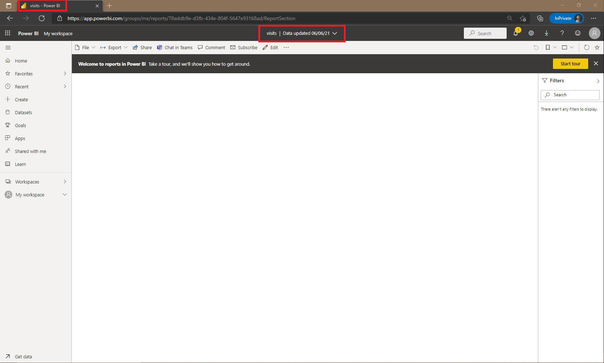
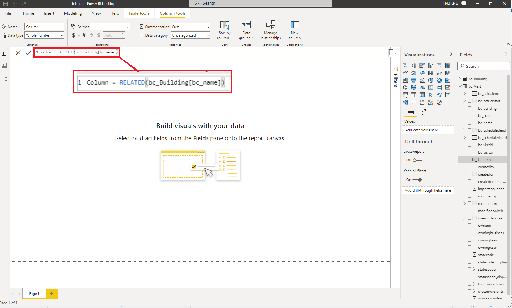

# Module 5: Get Started with Power BI

Lab: How to build a simple dashboard

Exercise #1: Create Power BI Report

Task #1: Install Power BI Desktop / Prepare Power BI service

Navigate to Microsoft Store and Power BI download proccess

![5-1_How_to_Build_Simple_Dashboard_Power_BI_01]Evidencia/5-1_How_to_Build_Simple_Dashboard_Power_BI_01.png)

![5-1_How_to_Build_Simple_Dashboard_Power_BI_02]Evidencia/5-1_How_to_Build_Simple_Dashboard_Power_BI_02.png)

![5-1_How_to_Build_Simple_Dashboard_Power_BI_03]Evidencia/5-1_How_to_Build_Simple_Dashboard_Power_BI_03.png)

![5-1_How_to_Build_Simple_Dashboard_Power_BI_04]Evidencia/5-1_How_to_Build_Simple_Dashboard_Power_BI_04.png)

![5-1_How_to_Build_Simple_Dashboard_Power_BI_05]Evidencia/5-1_How_to_Build_Simple_Dashboard_Power_BI_05.png)

Power BI installation process

![5-1_How_to_Build_Simple_Dashboard_Power_BI_06]Evidencia/5-1_How_to_Build_Simple_Dashboard_Power_BI_06.png)

![5-1_How_to_Build_Simple_Dashboard_Power_BI_07]Evidencia/5-1_How_to_Build_Simple_Dashboard_Power_BI_07.png)

![5-1_How_to_Build_Simple_Dashboard_Power_BI_08]Evidencia/5-1_How_to_Build_Simple_Dashboard_Power_BI_08.png)

![5-1_How_to_Build_Simple_Dashboard_Power_BI_09]Evidencia/5-1_How_to_Build_Simple_Dashboard_Power_BI_09.png)

![5-1_How_to_Build_Simple_Dashboard_Power_BI_10]Evidencia/5-1_How_to_Build_Simple_Dashboard_Power_BI_10.png)

Download visits.pbix file

Navigate to https://app.powerbi.com and Sign in

Upload visits.pbix file

Task #2: Prepare Data

Environment URL
https://org7318b351.crm4.dynamics.com/

Task #3: Create Chart and Time Visualizations

Exercise #2: Create Power BI Dashboard

Task #1: Publish Power BI Report

[Power BI](https://app.powerbi.com/groups/me/reports/6b072b54-3a36-4cea-b6fb-218bde164f43?pbi_source=desktop)

Task #2: Create Power BI Dashboard

Task #3: Add Visualizations Using Natural Language

Task #4: Build Mobile Phone View and Share a Report with a QR Code

Navigate and explore the report on my Android Mobile Phone

 
